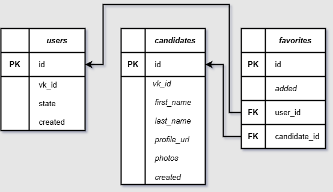

# VK Bot — Бот для знакомств в ВКонтакте

Программа-бот, разработанная в рамках командной работы по курсу **«Профессиональная работа с Python»** (Netology).  
Подбирает кандидатов для знакомств на основе возраста, пола и города, а также позволяет сохранять понравившихся пользователей в избранное.

## Основные функции

- **Диалоговый интерфейс**  
  Пользователь по шагам указывает: возраст → пол → город → бот показывает кандидатов.

- **Поиск по критериям**  
  Использует VK API для поиска открытых профилей по возрасту, полу и городу.

- **Фото с профиля**  
  Показывает топ-3 фото кандидата (по количеству лайков и комментариев).

- **Избранное**  
  Пользователь может добавлять кандидатов в избранное и просматривать их позже.

- **Без дублей**  
  Не показывает кандидатов, уже добавленных в избранное.

- **Восстановление состояния**  
  При перезапуске бот помнит, где остановился пользователь

## Схема базы данных



## Структура проекта

```
VK_Bot/
├── database/
│   ├── __init__.py
│   ├── manager.py
│   └── models.py
├── .env.example
├── .gitignore
├── config.py
├── db_schema.png
├── keyboard.py
├── main.py
├── README.md
├── requirements.txt
├── user_bot.py
└── vk_searcher.py
```

##  База данных

Проект использует PostgreSQL с тремя таблицами:

- **users** — пользователи бота (VK ID, состояние диалога)  
- **candidates** — найденные кандидаты (VK ID, имя, фото, ссылка)  
- **favorites** — связь пользователей и избранных кандидатов  

Схема создаётся автоматически при первом запуске.

## 🗄 Структура базы данных

```
VK_Bot/ 
├── database/ 
│ 
├── init.py 
│ 
├── manager.py 
│ 
└── models.py
```


### Модели PostgreSQL (SQLAlchemy ORM)

```
users (основной пользователь бота) 
├── id (Integer, Primary Key) 
├── vk_id (Integer, уникальный ID в ВК) 
├── state (Text, текущее состояние: wait_age, wait_sex, wait_city, showing) 
└── created (DateTime, дата регистрации)

candidates (найденные кандидаты) 
├── id (Integer, Primary Key) 
├── vk_id (Integer, уникальный ID кандидата в ВК) 
├── first_name (String, имя) 
├── last_name (String, фамилия) 
├── profile_url (String, ссылка vk.com/id...) 
├── photos (Text, строка вида "photo123_456,photo123_457") 
└── created (DateTime, дата добавления)

favorites (связь "избранное") 
├── id (Integer, Primary Key) 
├── user_id (Integer, внешний ключ → users.id) 
├── candidate_id (Integer, внешний ключ → candidates.id) 
└── added (DateTime, дата добавления)
```

> 🔗 Связи:  
> `users` (1) ───< `favorites` >─── (N) `candidates`  
> 
> Уникальность: один пользователь не может дважды добавить одного кандидата (`UniqueConstraint`).

## Как запустить

1. Создайте виртуальное окружение и установите зависимости:
   ```bash
   python -m venv venv
   source venv/Scripts/activate
   pip install -r requirements.txt
   ```

2. Создайте файл `.env` на основе шаблона:
   ```bash
   cp .env.example .env
   ```

3. Заполните `.env` своими значениями:
   ```env
   GROUP_TOKEN=ваш_токен_группы_вк
   USER_TOKEN=ваш_токен_пользователя_вк
   DB_HOST=localhost
   DB_PORT=5432
   DB_NAME=vk_bot
   DB_USER=имя_пользователя
   DB_PASS=пароль
   ```

4. **Создайте базу данных**  
   Выполните в терминале (замените `vk_bot` на имя из `.env`):
   ```bash
   python createdb -U postgres vk_bot
   ```
   > Таблицы (`users`, `candidates`, `favorites`) создаются автоматически при первом запуске.

5. Запустите бота:
   ```bash
   python main.py
   ```

## Получение токенов

### 1. **GROUP_TOKEN (токен группы)**

1. Создайте группу в VK.
2. Перейдите: Управление → Настройки → Работа с API.
3. Создайте ключ с правами:  
   - `messages` — для отправки сообщений.

### 2. **USER_TOKEN (токен пользователя)**

1. Перейдите по ссылке: https://vkhost.github.io/  
2. Выберите приложение **VK Admin**.
3. Нажмите на него, затем нажмите **«Разрешить»**.
4. Скопируйте часть адресной строки от `access_token=` до `&expires_in`.

##  Пример использования

1. Пользователь пишет: `/start`  
2. Бот: «Введите возраст»  
3. Пользователь: `25`  
4. Бот: «Выберите пол» → кнопки  
5. Пользователь: `1` (мужчина)  
6. Бот: «Введите город»  
7. Пользователь: `Москва`  
8. Бот находит кандидатов и показывает первого с фото  
9. Пользователь нажимает: «Добавить в избранное» → сохраняется  
10. Пользователь нажимает: «Дальше» → следующий кандидат  
11. Пользователь: «Избранное» → получает всех, кого добавил  


##  Технологии

- **vk-api** — работа с VK API и Long Poll  
- **SQLAlchemy** — ORM для работы с базой данных  
- **psycopg** — драйвер PostgreSQL  
- **python-dotenv** — загрузка переменных окружения  

##  Важные замечания

- Бот использует **USER_TOKEN** для поиска пользователей, так как методы поиска недоступны для токенов группы  
- Поиск ограничен 100 пользователями за запрос  

##  Решение проблем

**Бот не отвечает на сообщения:**  
- Проверьте, что Long Poll включён в настройках группы  
- Убедитесь, что GROUP_TOKEN имеет права на отправку сообщений  
- Проверьте, что бот может отправлять сообщения от имени группы  

**Ошибка подключения к базе данных:**  
- Проверьте, что PostgreSQL запущен  
- Убедитесь, что данные в `.env` указаны правильно  
- Проверьте права пользователя БД  

**Не находятся кандидаты:**  
- Попробуйте изменить критерии поиска  
- Проверьте, что USER_TOKEN действителен  
- Убедитесь, что город введён правильно  

---

##  Возможные улучшения (фичи)

- [ ] Настроить **Alembic** — для миграций БД
- [ ] Добавить **Dockerfile** и `docker-compose.yml` — для полного запуска в контейнерах
- [ ] Реализовать **тесты** (`pytest`)
- [ ] Добавить **ограничение на количество запросов к ВК** (rate limit)
- [ ] Поддержка **учёта возраста из bdate** (точнее)
- [ ] Сохранение **нескольких фото** для кандидата

---

## Авторы

[@Rom2555](https://github.com/Rom2555)
[@artsvolk](https://github.com/artsvolk)
[@Leo](https://github.com/lev841243-gif)

Учебный проект для курса Нетологии
